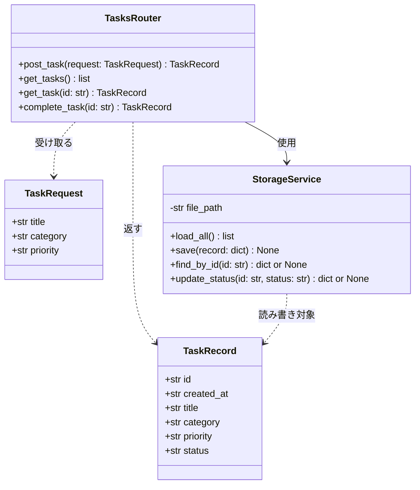
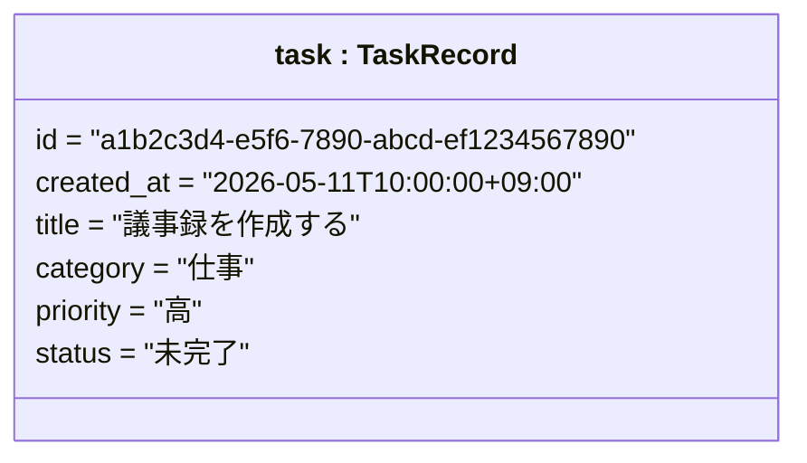
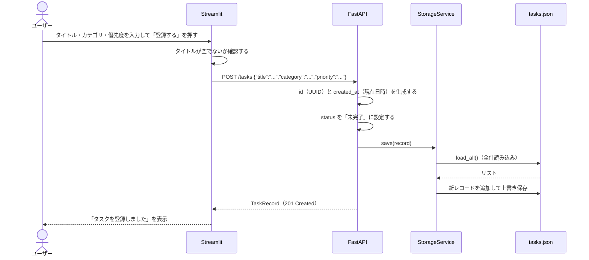
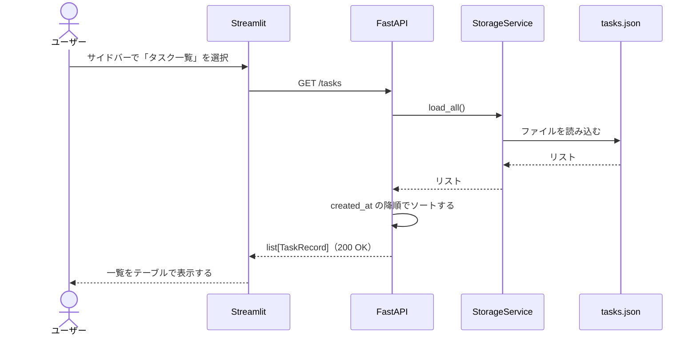
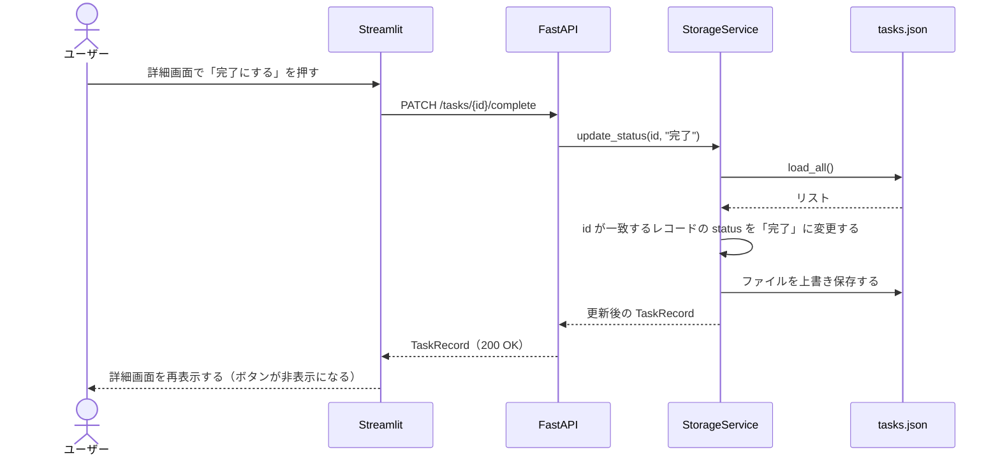
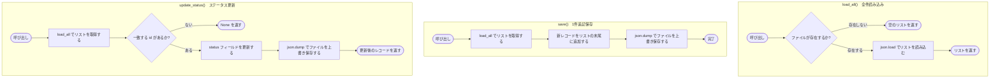

# 設計図

**プロジェクト名：** 個人タスク管理アプリ  
**作成日：** 2026-05-11

---

## 1. クラス図

バックエンドのクラス構成と依存関係を示す。



**クラスの役割まとめ**

| クラス | ファイル | 役割 |
|---|---|---|
| `TaskRequest` | backend/models.py | POSTリクエストのボディを受け取るモデル |
| `TaskRecord` | backend/models.py | 保存・返却するデータのモデル |
| `StorageService` | backend/services/storage_service.py | JSONファイルの読み書きを担当する |
| `TasksRouter` | backend/routers/tasks.py | APIエンドポイントを定義し、StorageServiceを呼び出す |

---

## 2. オブジェクト図

`TaskRecord` クラスの具体的なインスタンス例を示す。



**JSONファイル上での表現**

```json
[
  {
    "id": "a1b2c3d4-e5f6-7890-abcd-ef1234567890",
    "created_at": "2026-05-11T10:00:00+09:00",
    "title": "議事録を作成する",
    "category": "仕事",
    "priority": "高",
    "status": "未完了"
  },
  {
    "id": "b2c3d4e5-f6a7-8901-bcde-f12345678901",
    "created_at": "2026-05-10T14:30:00+09:00",
    "title": "本を返却する",
    "category": "プライベート",
    "priority": "低",
    "status": "完了"
  }
]
```

---

## 3. シーケンス図

### 3.1 タスク登録（正常系）



### 3.2 一覧表示



### 3.3 タスク完了更新



---

## 4. フロー図

### 4.1 StorageService 処理フロー



### 4.2 画面遷移フロー

```mermaid
flowchart TD
    Start([アプリ起動]) --> Menu{サイドバーの選択}

    Menu -->|タスク登録| RegPage[タスク登録画面を表示する]
    RegPage --> TitleCheck{タイトルが空か?}
    TitleCheck -->|空| RegError[エラーメッセージを表示する]
    RegError --> RegPage
    TitleCheck -->|入力あり| PostAPI[POST /tasks を送信する]
    PostAPI --> PostResult{APIの結果}
    PostResult -->|成功| ShowRegSuccess[「タスクを登録しました」を表示する]
    PostResult -->|失敗| PostError[エラーメッセージを表示する]

    Menu -->|タスク一覧| ListPage[一覧画面を表示する]
    ListPage --> GetAPI[GET /tasks を送信する]
    GetAPI --> ListCount{件数が0件か?}
    ListCount -->|0件| EmptyMsg[「タスクがありません」を表示する]
    ListCount -->|1件以上| ShowList[一覧をテーブルで表示する]
    ShowList --> DetailBtn{「詳細を見る」を押した?}
    DetailBtn -->|はい| SaveState[session_state に selected_id を保存する]
    SaveState --> DetailPage[詳細画面を表示する]
    DetailPage --> StatusCheck{ステータスが未完了か?}
    StatusCheck -->|未完了| ShowComplete[「完了にする」ボタンを表示する]
    StatusCheck -->|完了| HideComplete[「完了にする」ボタンを非表示にする]
    ShowComplete --> CompleteBtn{「完了にする」を押した?}
    CompleteBtn -->|はい| PatchAPI[PATCH /tasks/{id}/complete を送信する]
    PatchAPI --> DetailPage
    DetailPage --> BackBtn{「一覧に戻る」を押した?}
    BackBtn -->|はい| ListPage
```
