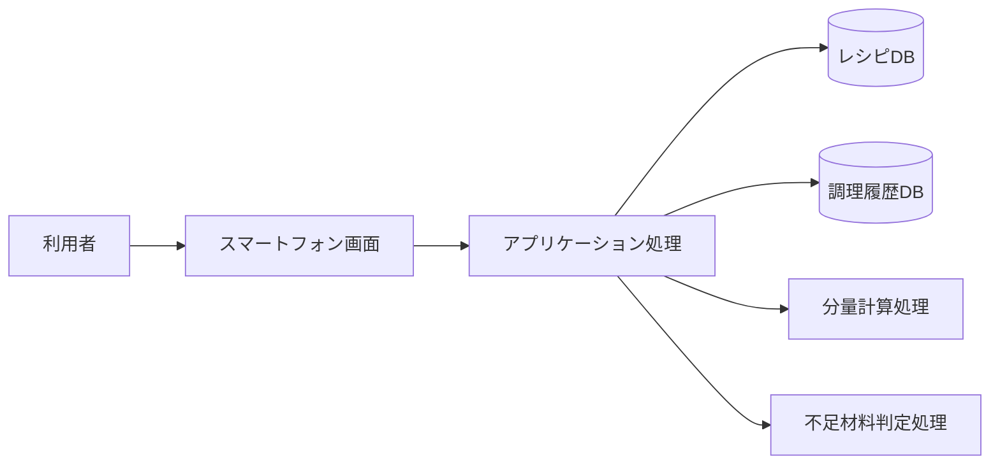
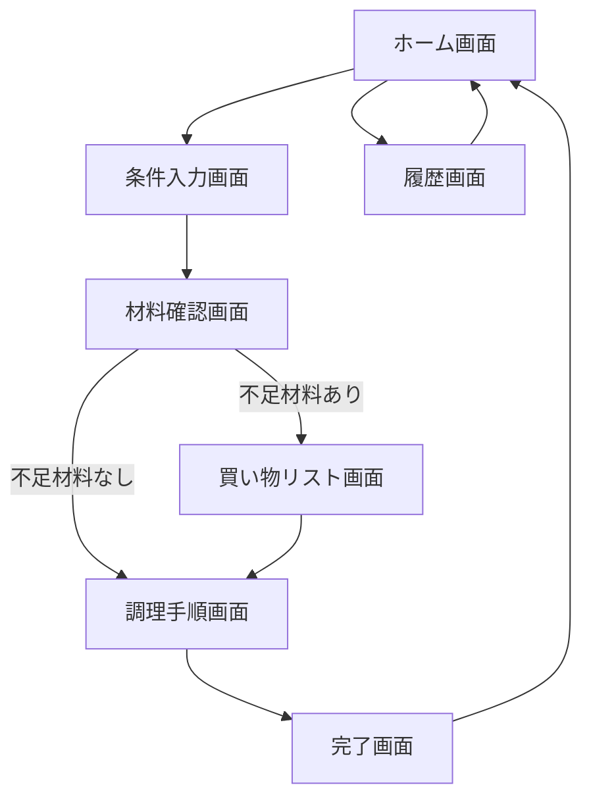
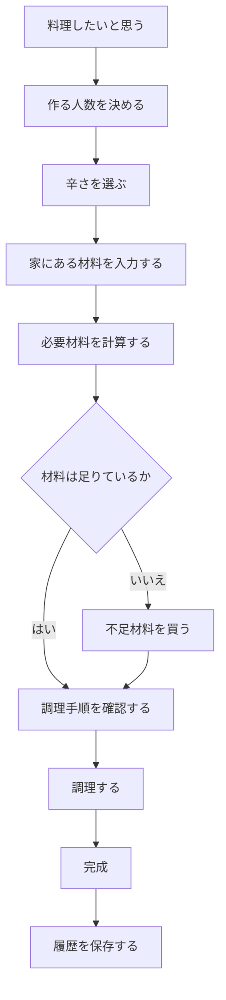
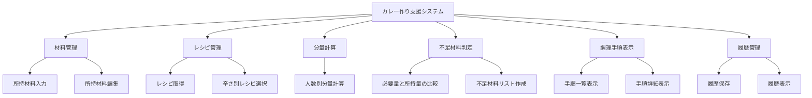
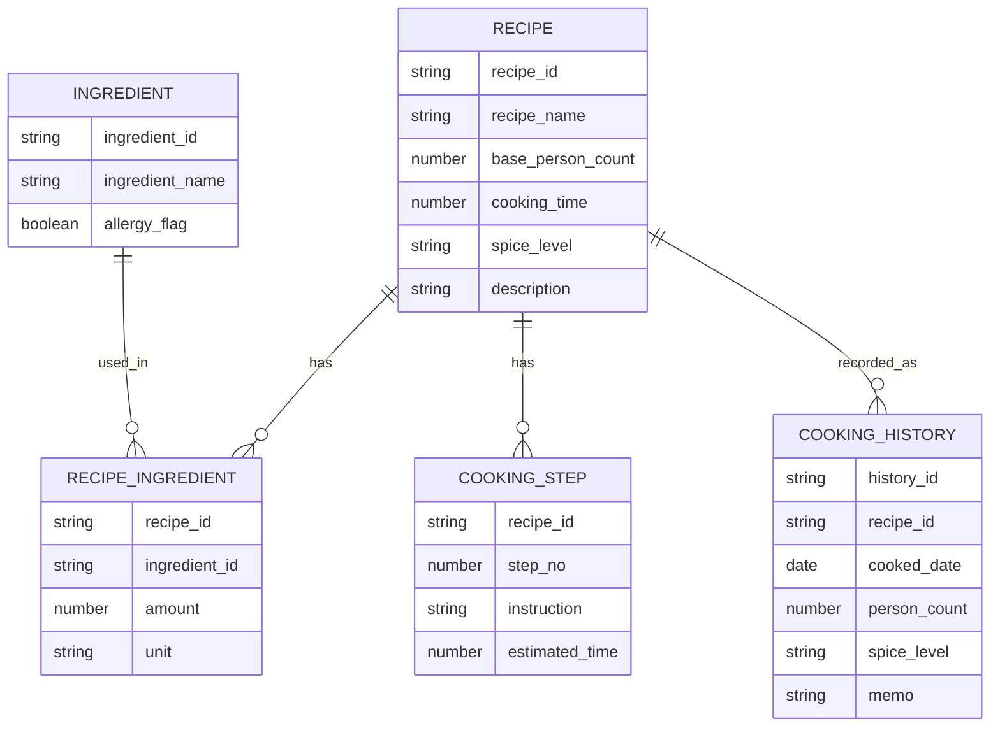
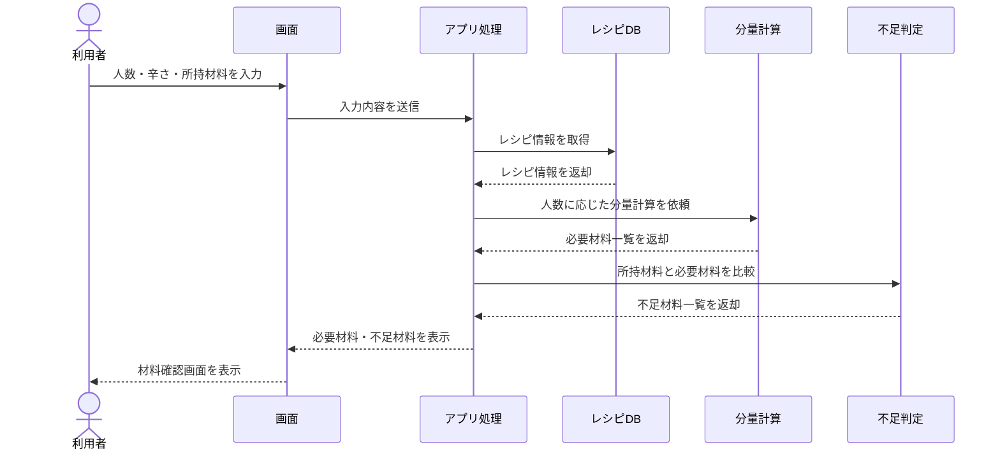
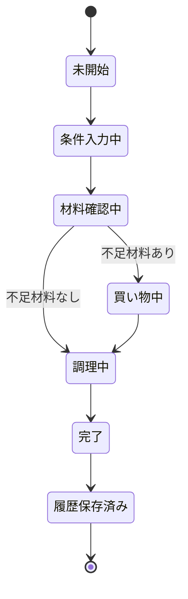

# 身近な例で理解するシステム設計資料
## 例題：カレー作り支援システム

---

## 1. この資料の目的

本資料は、システム開発でよく使われる以下の設計資料の役割を、身近な「料理」を例にして説明するための資料です。

- 要求仕様書
- 要件定義書
- 基本設計書
- 詳細設計書
- その他設計図
  - 業務フロー図
  - 画面遷移図
  - データ設計図
  - シーケンス図
  - 状態遷移図
  - テスト観点表

題材として、**「カレー作り支援システム」**を使います。

---

## 2. システム設計を料理で例えると

システム設計は、料理の準備に似ています。

| システム開発の資料 | 料理で例えると | 目的 |
|---|---|---|
| 要求仕様書 | 家族やお客さんの希望 | 何を実現したいかを整理する |
| 要件定義書 | 作る料理の条件整理 | システムとして満たすべき条件を決める |
| 基本設計書 | 調理全体の段取り | システム全体の構成や処理の流れを決める |
| 詳細設計書 | 具体的なレシピ | 実装できるレベルまで細かく決める |
| その他設計図 | 調理手順図、材料表、盛り付け図 | 関係者が同じ理解で進めるための補足図 |

---

# 第1章：要求仕様書

## 1.1 要求仕様書とは

要求仕様書は、利用者や依頼者が「こうしたい」「こうなってほしい」と考えている内容を整理した資料です。

この段階では、まだ技術的にどう実現するかまでは詳しく決めません。

料理で言えば、以下のような会話です。

> 家族から  
> 「今日の夕飯はカレーがいい」  
> 「子どもも食べられる辛さにしてほしい」  
> 「できれば30分くらいで作ってほしい」  
> 「冷蔵庫にある材料を使ってほしい」

これらは、まだレシピではありません。  
しかし、料理を作るうえで大切な「希望」や「目的」です。

---

## 1.2 カレー作り支援システムの要求仕様書

### システム名

カレー作り支援システム

### 背景

家庭でカレーを作るとき、以下のような困りごとがある。

- 冷蔵庫にある材料で何人分作れるかわからない
- 辛さを家族に合わせて調整したい
- 調理手順を忘れることがある
- 材料の買い忘れが起きる
- 調理時間の目安がわかりにくい

### 目的

家庭でカレーを作る人が、材料確認、分量計算、調理手順確認を簡単に行えるようにする。

### 利用者

| 利用者 | 説明 |
|---|---|
| 主利用者 | 家庭で料理をする人 |
| 補助利用者 | 家族、同居人 |
| 管理者 | レシピ情報を登録・更新する人 |

### 利用者からの要求

| No | 要求内容 |
|---|---|
| R-001 | 家にある材料を入力したい |
| R-002 | 何人分作るかを指定したい |
| R-003 | 辛さを選びたい |
| R-004 | 材料の不足分を知りたい |
| R-005 | 調理手順を順番に確認したい |
| R-006 | 調理時間の目安を知りたい |
| R-007 | 子ども向け、大人向けなどの味を選びたい |
| R-008 | 買い物リストを表示したい |
| R-009 | 作ったカレーを履歴として残したい |

---

## 1.3 要求仕様書で重要なこと

要求仕様書では、以下を明確にすることが重要です。

- 誰が使うのか
- 何に困っているのか
- 何を実現したいのか
- 優先度は高いのか低いのか
- 実現方法ではなく、利用者の希望を整理する

---

# 第2章：要件定義書

## 2.1 要件定義書とは

要件定義書は、要求仕様書に書かれた利用者の希望を、システムとして実現すべき条件に整理した資料です。

料理で言えば、以下のように希望を具体化する段階です。

> 「子どもも食べられる辛さ」  
> → 甘口、中辛、辛口を選べるようにする  
>
> 「30分くらいで作りたい」  
> → 調理時間が30分以内のレシピを表示する  
>
> 「材料の買い忘れを防ぎたい」  
> → 不足材料を買い物リストとして表示する

要求は「したいこと」です。  
要件は「システムが満たすべきこと」です。

---

## 2.2 機能要件

### 機能一覧

| No | 機能名 | 概要 | 対応する要求 |
|---|---|---|---|
| F-001 | 材料入力機能 | 利用者が持っている材料を入力する | R-001 |
| F-002 | 人数指定機能 | 何人分作るかを指定する | R-002 |
| F-003 | 辛さ選択機能 | 甘口・中辛・辛口を選択する | R-003, R-007 |
| F-004 | 分量計算機能 | 人数に応じて材料の必要量を計算する | R-002 |
| F-005 | 不足材料判定機能 | 所持材料と必要材料を比較する | R-004 |
| F-006 | 買い物リスト表示機能 | 不足材料を一覧表示する | R-008 |
| F-007 | 調理手順表示機能 | 調理手順を順番に表示する | R-005 |
| F-008 | 調理時間表示機能 | 調理時間の目安を表示する | R-006 |
| F-009 | 調理履歴保存機能 | 作ったカレーの履歴を保存する | R-009 |

---

## 2.3 非機能要件

非機能要件は、機能そのものではなく、使いやすさ、性能、安全性、保守性などに関する要件です。

| No | 分類 | 要件 |
|---|---|---|
| NF-001 | 使いやすさ | 料理に詳しくない人でも使える画面にする |
| NF-002 | 性能 | 材料入力後、3秒以内に不足材料を表示する |
| NF-003 | 可用性 | スマートフォンで利用できること |
| NF-004 | 保守性 | レシピ情報を後から追加・変更できること |
| NF-005 | 安全性 | アレルギー食材を注意表示できること |
| NF-006 | 拡張性 | 将来的にカレー以外の料理にも対応できること |

---

## 2.4 対象範囲

### 対象とする範囲

- カレーのレシピ表示
- 材料入力
- 人数に応じた分量計算
- 不足材料の判定
- 買い物リスト表示
- 調理手順表示
- 調理履歴保存

### 対象外とする範囲

- 実際の食材購入
- ネットスーパーとの連携
- 栄養管理
- 家計簿連携
- 音声操作
- 調理器具との自動連携

---

## 2.5 要求と要件のトレーサビリティ

| 要求ID | 要求内容 | 対応する機能要件 |
|---|---|---|
| R-001 | 家にある材料を入力したい | F-001 |
| R-002 | 何人分作るかを指定したい | F-002, F-004 |
| R-003 | 辛さを選びたい | F-003 |
| R-004 | 材料の不足分を知りたい | F-005 |
| R-005 | 調理手順を順番に確認したい | F-007 |
| R-006 | 調理時間の目安を知りたい | F-008 |
| R-007 | 子ども向け、大人向けなどの味を選びたい | F-003 |
| R-008 | 買い物リストを表示したい | F-006 |
| R-009 | 作ったカレーを履歴として残したい | F-009 |

---

# 第3章：基本設計書

## 3.1 基本設計書とは

基本設計書は、要件定義で決めた内容をもとに、システム全体をどのように作るかを整理する資料です。

料理で言えば、以下のような段取りを決める資料です。

> 1. 材料を確認する  
> 2. 足りない材料を買う  
> 3. 野菜を切る  
> 4. 肉を炒める  
> 5. 水を入れて煮込む  
> 6. ルーを入れる  
> 7. 盛り付ける  

この段階では、システム全体の構成、画面、処理の流れ、データの流れを決めます。

---

## 3.2 システム全体構成



### 構成要素

| 構成要素 | 役割 |
|---|---|
| スマートフォン画面 | 利用者が材料や人数を入力する |
| アプリケーション処理 | 入力内容を受け取り、各処理を呼び出す |
| レシピDB | レシピ、材料、調理手順を保存する |
| 調理履歴DB | 過去に作ったカレーの情報を保存する |
| 分量計算処理 | 人数に応じて必要材料を計算する |
| 不足材料判定処理 | 所持材料と必要材料を比較する |

---

## 3.3 画面一覧

| 画面ID | 画面名 | 概要 |
|---|---|---|
| S-001 | ホーム画面 | レシピ選択や履歴確認を行う |
| S-002 | 条件入力画面 | 人数、辛さ、所持材料を入力する |
| S-003 | 材料確認画面 | 必要材料と不足材料を確認する |
| S-004 | 買い物リスト画面 | 不足材料を買い物リストとして表示する |
| S-005 | 調理手順画面 | 調理手順を順番に表示する |
| S-006 | 完了画面 | 調理完了と履歴保存を行う |
| S-007 | 履歴画面 | 過去に作ったカレーを確認する |

---

## 3.4 画面遷移図



---

## 3.5 業務フロー図

料理を始めてから完了するまでの流れを表します。



---

## 3.6 機能構成



---

# 第4章：詳細設計書

## 4.1 詳細設計書とは

詳細設計書は、基本設計で決めた内容を、実装できるレベルまで具体化した資料です。

料理で言えば、以下のような具体的なレシピです。

> 玉ねぎを薄切りにする。  
> 鍋に油を大さじ1入れる。  
> 中火で5分炒める。  
> 水600mlを入れて15分煮込む。  
> 火を止めてルーを入れる。  

「どう作るか」が具体的に書かれているため、担当者が変わっても同じものを作りやすくなります。

---

## 4.2 機能詳細：分量計算機能

### 機能ID

F-004

### 機能名

分量計算機能

### 概要

利用者が指定した人数に応じて、カレーに必要な材料の量を計算する。

### 入力

| 項目 | 型 | 例 | 必須 |
|---|---|---|---|
| recipe_id | 文字列 | curry_basic | ○ |
| person_count | 数値 | 4 | ○ |
| spice_level | 文字列 | mild | ○ |

### 出力

| 項目 | 型 | 例 |
|---|---|---|
| ingredient_name | 文字列 | 玉ねぎ |
| required_amount | 数値 | 2 |
| unit | 文字列 | 個 |

### 処理仕様

1. recipe_idをもとにレシピ情報を取得する
2. 基準人数を取得する
3. 指定人数 ÷ 基準人数 を倍率として計算する
4. 各材料の基準量に倍率を掛ける
5. 必要に応じて小数点を丸める
6. 計算結果を材料一覧として返す

### 計算例

基準レシピが4人分の場合。

| 材料 | 4人分の量 | 2人分の場合 |
|---|---:|---:|
| 玉ねぎ | 2個 | 1個 |
| にんじん | 1本 | 0.5本 |
| じゃがいも | 3個 | 1.5個 |
| 肉 | 300g | 150g |
| カレールー | 1/2箱 | 1/4箱 |

### 疑似コード

```text
function calculateIngredients(recipe, personCount):
    basePersonCount = recipe.basePersonCount
    rate = personCount / basePersonCount

    result = []

    for ingredient in recipe.ingredients:
        requiredAmount = ingredient.amount * rate
        result.add({
            name: ingredient.name,
            amount: roundAmount(requiredAmount),
            unit: ingredient.unit
        })

    return result
```

---

## 4.3 機能詳細：不足材料判定機能

### 機能ID

F-005

### 機能名

不足材料判定機能

### 概要

必要材料と利用者が持っている材料を比較し、不足している材料を判定する。

### 入力

| 項目 | 型 | 例 |
|---|---|---|
| required_ingredients | 配列 | 玉ねぎ2個、肉300g |
| owned_ingredients | 配列 | 玉ねぎ1個、肉200g |

### 出力

| 項目 | 型 | 例 |
|---|---|---|
| shortage_ingredients | 配列 | 玉ねぎ1個、肉100g |

### 判定ルール

| 条件 | 判定 |
|---|---|
| 所持量 >= 必要量 | 不足なし |
| 所持量 < 必要量 | 差分を不足量とする |
| 所持材料に存在しない | 必要量すべてを不足量とする |
| 単位が異なる | 単位変換可能な場合は変換して比較する |
| 単位変換できない | 判定不可として注意表示する |

### 疑似コード

```text
function judgeShortage(requiredIngredients, ownedIngredients):
    shortageList = []

    for required in requiredIngredients:
        owned = findOwnedIngredient(required.name)

        if owned does not exist:
            shortageList.add(required)
            continue

        if owned.amount < required.amount:
            shortageAmount = required.amount - owned.amount
            shortageList.add({
                name: required.name,
                amount: shortageAmount,
                unit: required.unit
            })

    return shortageList
```

---

## 4.4 データ設計

### レシピテーブル

| 項目名 | 型 | 説明 |
|---|---|---|
| recipe_id | string | レシピID |
| recipe_name | string | レシピ名 |
| base_person_count | number | 基準人数 |
| cooking_time | number | 調理時間 |
| spice_level | string | 辛さ |
| description | string | 説明文 |

### 材料テーブル

| 項目名 | 型 | 説明 |
|---|---|---|
| ingredient_id | string | 材料ID |
| ingredient_name | string | 材料名 |
| allergy_flag | boolean | アレルギー注意有無 |

### レシピ材料テーブル

| 項目名 | 型 | 説明 |
|---|---|---|
| recipe_id | string | レシピID |
| ingredient_id | string | 材料ID |
| amount | number | 必要量 |
| unit | string | 単位 |

### 調理手順テーブル

| 項目名 | 型 | 説明 |
|---|---|---|
| recipe_id | string | レシピID |
| step_no | number | 手順番号 |
| instruction | string | 手順説明 |
| estimated_time | number | 目安時間 |

### 調理履歴テーブル

| 項目名 | 型 | 説明 |
|---|---|---|
| history_id | string | 履歴ID |
| recipe_id | string | レシピID |
| cooked_date | date | 調理日 |
| person_count | number | 人数 |
| spice_level | string | 辛さ |
| memo | string | メモ |

---

## 4.5 ER図



---

## 4.6 API設計例

### レシピ取得API

| 項目 | 内容 |
|---|---|
| API名 | レシピ取得API |
| メソッド | GET |
| URL | `/api/recipes/{recipe_id}` |
| 概要 | 指定されたレシピ情報を取得する |

#### レスポンス例

```json
{
  "recipe_id": "curry_basic",
  "recipe_name": "基本のカレー",
  "base_person_count": 4,
  "cooking_time": 30,
  "spice_level": "mild",
  "ingredients": [
    {
      "name": "玉ねぎ",
      "amount": 2,
      "unit": "個"
    },
    {
      "name": "にんじん",
      "amount": 1,
      "unit": "本"
    }
  ],
  "steps": [
    {
      "step_no": 1,
      "instruction": "野菜を切る",
      "estimated_time": 5
    },
    {
      "step_no": 2,
      "instruction": "肉と野菜を炒める",
      "estimated_time": 10
    }
  ]
}
```

---

## 4.7 シーケンス図

利用者が人数と材料を入力し、不足材料を確認するまでの流れです。



---

## 4.8 状態遷移図

カレー作り支援システムにおける「調理状態」の遷移を表します。



---

# 第5章：その他設計図

## 5.1 画面レイアウト例

### 条件入力画面

```text
+----------------------------------+
| カレー作り支援                   |
+----------------------------------+
| 作る人数                         |
| [ 4 ] 人                         |
|                                  |
| 辛さ                             |
| (○) 甘口  ( ) 中辛  ( ) 辛口     |
|                                  |
| 家にある材料                     |
| [玉ねぎ] [2] [個]                |
| [にんじん] [1] [本]              |
| [肉] [200] [g]                   |
|                                  |
| [材料を確認する]                 |
+----------------------------------+
```

---

### 材料確認画面

```text
+----------------------------------+
| 材料確認                         |
+----------------------------------+
| 必要な材料                       |
| ・玉ねぎ 2個                     |
| ・にんじん 1本                   |
| ・肉 300g                        |
|                                  |
| 不足している材料                 |
| ・肉 100g                        |
|                                  |
| [買い物リストを見る]             |
| [このまま調理を始める]           |
+----------------------------------+
```

---

## 5.2 入力チェック仕様

| 項目 | チェック内容 | エラー表示 |
|---|---|---|
| 人数 | 1以上10以下であること | 人数は1〜10人で入力してください |
| 材料名 | 空欄でないこと | 材料名を入力してください |
| 材料量 | 0より大きい数値であること | 材料量は0より大きい値を入力してください |
| 単位 | 指定された単位から選択すること | 単位を選択してください |
| 辛さ | 甘口・中辛・辛口のいずれかであること | 辛さを選択してください |

---

## 5.3 エラー処理設計

| エラー | 原因 | 対応 |
|---|---|---|
| レシピが見つからない | recipe_idが不正 | ホーム画面へ戻す |
| 材料量が不正 | 数値以外が入力された | 入力エラーを表示する |
| 単位変換できない | gと個など変換不能な単位 | 判定不可として注意表示する |
| 履歴保存に失敗 | 保存処理エラー | 再試行ボタンを表示する |
| 通信失敗 | ネットワーク不安定 | オフライン時の案内を表示する |

---

## 5.4 テスト観点表

| テストID | 観点 | 確認内容 |
|---|---|---|
| T-001 | 人数指定 | 1人分、4人分、10人分で分量が正しく変わるか |
| T-002 | 辛さ選択 | 甘口・中辛・辛口で正しいレシピが選択されるか |
| T-003 | 不足判定 | 所持材料が足りない場合に不足量が表示されるか |
| T-004 | 不足なし | 材料が足りている場合に不足なしと表示されるか |
| T-005 | 買い物リスト | 不足材料だけが表示されるか |
| T-006 | 調理手順 | 手順番号どおりに表示されるか |
| T-007 | 履歴保存 | 調理完了後に履歴が保存されるか |
| T-008 | 入力エラー | 不正な人数や材料量でエラー表示されるか |

---

# 第6章：各資料の違いまとめ

## 6.1 資料ごとの役割

| 資料 | 主な関心 | 書く内容 | 読む人 |
|---|---|---|---|
| 要求仕様書 | 何をしたいか | 利用者の希望、困りごと、目的 | 依頼者、企画者、開発者 |
| 要件定義書 | 何を満たすべきか | 機能要件、非機能要件、対象範囲 | 依頼者、開発者、管理者 |
| 基本設計書 | どう構成するか | 画面、機能、処理の流れ、全体構成 | 開発者、設計者、テスト担当 |
| 詳細設計書 | どう実装するか | 処理仕様、データ仕様、API仕様 | 開発者 |
| テスト仕様書 | 正しく動くか | 確認観点、テストケース、期待結果 | テスト担当、開発者 |

---

## 6.2 カレー作りでの対応関係

| 段階 | カレー作りの例 | システム開発の例 |
|---|---|---|
| 要求 | 家族が「甘口カレーが食べたい」と言う | 利用者が「使いやすいアプリがほしい」と言う |
| 要件 | 4人分、甘口、30分以内と決める | 人数指定、辛さ選択、30分以内のレシピ表示を決める |
| 基本設計 | 材料確認、買い物、調理の流れを決める | 画面構成、機能構成、処理の流れを決める |
| 詳細設計 | 玉ねぎ2個、肉300g、水600mlと決める | テーブル項目、計算式、API仕様を決める |
| 実装 | 実際に料理する | プログラムを書く |
| テスト | 味見する、火が通っているか確認する | 動作確認、単体テスト、結合テストを行う |

---

# 第7章：設計資料を作るときのポイント

## 7.1 要求仕様書のポイント

- 利用者の言葉をそのまま残す
- 実現方法を先に決めすぎない
- 誰の要求なのかを明確にする
- 優先度を付ける

## 7.2 要件定義書のポイント

- 要求をシステムの条件に変換する
- 対象範囲と対象外範囲を明確にする
- 機能要件と非機能要件を分ける
- 後で検証できる表現にする

## 7.3 基本設計書のポイント

- システム全体の構造を見える化する
- 画面、機能、データ、処理の流れを整理する
- 関係者が同じ理解を持てるようにする
- 細かすぎる実装方法には入りすぎない

## 7.4 詳細設計書のポイント

- 実装者が迷わない粒度で書く
- 入力、処理、出力を明確にする
- エラー処理も書く
- データ項目や型を明確にする
- テストしやすい仕様にする

---

# 第8章：まとめ

システム設計資料は、単に文書を作ることが目的ではありません。

目的は、関係者の認識を合わせ、後工程で迷わず開発・テストできる状態を作ることです。

料理に例えると、以下のように考えると理解しやすくなります。


これをシステム開発に置き換えると、以下のようになります。


重要なのは、上流の内容が下流に正しくつながっていることです。

つまり、

- 要求が要件に変換されている
- 要件が設計に反映されている
- 設計が実装に落とし込まれている
- 実装内容がテストで確認できる

という流れを作ることが、システム設計の基本です。

---

# 付録：資料作成テンプレート

## A. 要求仕様書テンプレート

```text
1. 背景
2. 目的
3. 利用者
4. 利用シーン
5. 要求一覧
6. 優先度
7. 制約条件
8. 未決事項
```

## B. 要件定義書テンプレート

```text
1. システム概要
2. 対象範囲
3. 対象外範囲
4. 機能要件
5. 非機能要件
6. 外部インターフェース
7. データ要件
8. 運用要件
9. 制約条件
10. 要求・要件対応表
```

## C. 基本設計書テンプレート

```text
1. システム構成
2. 機能構成
3. 画面一覧
4. 画面遷移
5. 業務フロー
6. データ構成
7. 外部連携
8. エラー方針
9. セキュリティ方針
10. 運用方針
```

## D. 詳細設計書テンプレート

```text
1. 機能ID
2. 機能名
3. 処理概要
4. 入力項目
5. 出力項目
6. 処理詳細
7. 判定条件
8. エラー処理
9. データ更新内容
10. テスト観点
```
